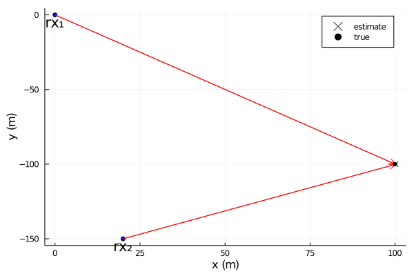
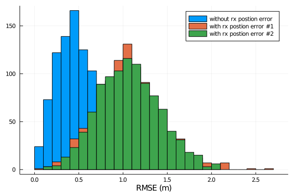
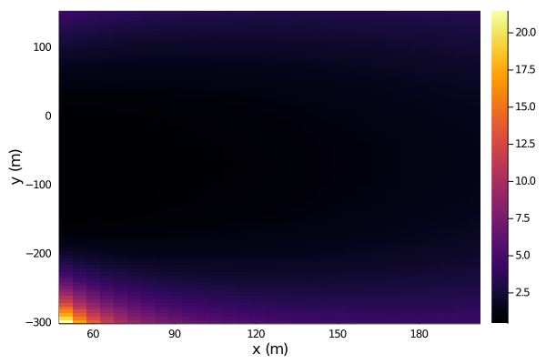
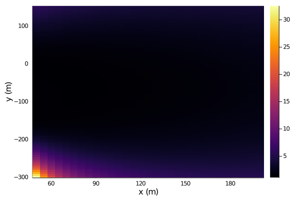

# MultiarraySourceLocalization

This package implements methods and simulations for practical source localization using multiple arrays.

## Usage
```juilia
using Plots, MultiarraySourceLocalization

txpos = [100, -100, 5]
rx1angles = [5, -10, -3]
rx2angles = [8, 6, 0.2]
σ = (0.2, 0.01, 0.01)
esttxpos = simulate(txpos=txpos, rx1angles=rx1angles, rx2angles=rx2angles, σ=σ)
plotconfig(rx1pos, rx2pos, txpos, esttxpos)
```

```julia
nrealizations = 1000
esttxposs1 = hcat([esttxpostmp = simulate(txpos=txpos, rx1angles=rx1angles, 
    rx2angles=rx2angles, σ=σ, ϵ=0.) for i in 1:nrealizations]...)
esttxposs2 = hcat([esttxpostmp = simulate(txpos=txpos, rx1angles=rx1angles, 
    rx2angles=rx2angles, σ=σ, ϵ=1.0) for i in 1:nrealizations]...)
esttxposs3 = hcat([esttxpostmp = simulate(txpos=txpos, rx1angles=rx1angles, 
    rx2angles=rx2angles, σ=σ, ϵ=-1.0) for i in 1:nrealizations]...)
rmses1 = rms(txpos .- esttxposs1; dims=1)
rmses2 = rms(txpos .- esttxposs2; dims=1)
rmses3 = rms(txpos .- esttxposs3; dims=1)
histogram(rmses1; xlabel="RMSE (m)", label="without rx postion error")
histogram!(rmses2; xlabel="RMSE (m)", label="with rx postion error #1")
histogram!(rmses3; xlabel="RMSE (m)", label="with rx postion error #2")
```

```julia
function plotrmsemap(;ϵ=0.)
    xtxposs = 50:5:200
    ytxposs = -300:5:150
    ztxposs = -5:1:5
    μ = zeros(length(xtxposs), length(ytxposs), length(ztxposs))
    for (i, xtxpos) in enumerate(xtxposs)
        for (j, ytxpos) in enumerate(ytxposs)
            for (k, ztxpos) in enumerate(ztxposs)
                txpostmp = [xtxpos,ytxpos,ztxpos]
                esttxposs = hcat([simulate(txpos=txpostmp, rx1angles=rx1angles, rx2angles=rx2angles, σ=σ, ϵ=ϵ) for i in 1:nrealizations]...)
                μ[i,j,k] = sum(rms(txpostmp .- esttxposs; dims=1)) / nrealizations
            end
        end
    end
    heatmap(xtxposs, ytxposs, dropdims(sum(μ; dims=3)/length(ztxposs); dims=3)'; xlabel="x (m)", ylabel="y (m)")
end

plotrmsemap(ϵ=0.)
plotrmsemap(ϵ=1.)
plotrmsemap(ϵ=-1.)
```
Without rx position error


With rx position error #1


With rx position error #2
