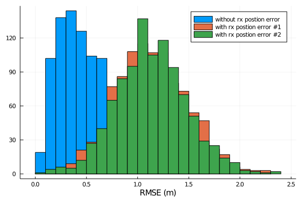

# MultiarraySourceLocalization

This package implements methods and simulations for practical source localization using multiple arrays.

## Usage
```juilia
using Plots, MultiarraySourceLocalization

txpos = [100, -100, 5]
rx1angles = [5, -10, -3]
rx2angles = [8, 6, 0.2]
σ = (0.2, 0.01, 0.01)
nrealizations = 1000
esttxposs1 = hcat([esttxpostmp = simulate(txpos=txpos, rx1angles=rx1angles, 
                   rx2angles=rx2angles, σ=σ, ϵ=0.) for i in 1:nrealizations]...)
esttxposs2 = hcat([esttxpostmp = simulate(txpos=txpos, rx1angles=rx1angles, 
                   rx2angles=rx2angles, σ=σ, ϵ=1.0) for i in 1:nrealizations]...)
esttxposs3 = hcat([esttxpostmp = simulate(txpos=txpos, rx1angles=rx1angles, 
                   rx2angles=rx2angles, σ=σ, ϵ=-1.0) for i in 1:nrealizations]...)
rmses1 = rms(txpos .- esttxposs1; dims=1)
rmses2 = rms(txpos .- esttxposs2; dims=1)
rmses3 = rms(txpos .- esttxposs3; dims=1)
histogram(rmses1; xlabel="RMSE (m)", label="without rx postion error")
histogram!(rmses2; xlabel="RMSE (m)", label="with rx postion error #1")
histogram!(rmses3; xlabel="RMSE (m)", label="with rx postion error #2")
```

```julia
using AbstractPlotting, GLMakie
GLMakie.activate!()

xtxposs = 50:10:200
ytxposs = -350:10:200
ztxposs = -5:1:5
μ = zeros(length(xtxposs), length(ytxposs), length(ztxposs))
for (i, xtxpos) in enumerate(xtxposs)
    for (j, ytxpos) in enumerate(ytxposs)
        for (k, ztxpos) in enumerate(ztxposs)
            txpostmp = [xtxpos,ytxpos,ztxpos]
            esttxposs = hcat([esttxpostmp = simulate(txpos=txpostmp, rx1angles=rx1angles, 
                  rx2angles=rx2angles, σ=σ) for i in 1:nrealizations]...)
            μ[i,j,k] = sum(rms(txpostmp .- esttxposs; dims=1)) / nrealizations
        end
    end
end
vplot = volume(μ; transparency=true)
AbstractPlotting.xlabel!(vplot, "x (m)")
AbstractPlotting.ylabel!(vplot, "y (m)")
AbstractPlotting.zlabel!(vplot, "z (m)")
```
